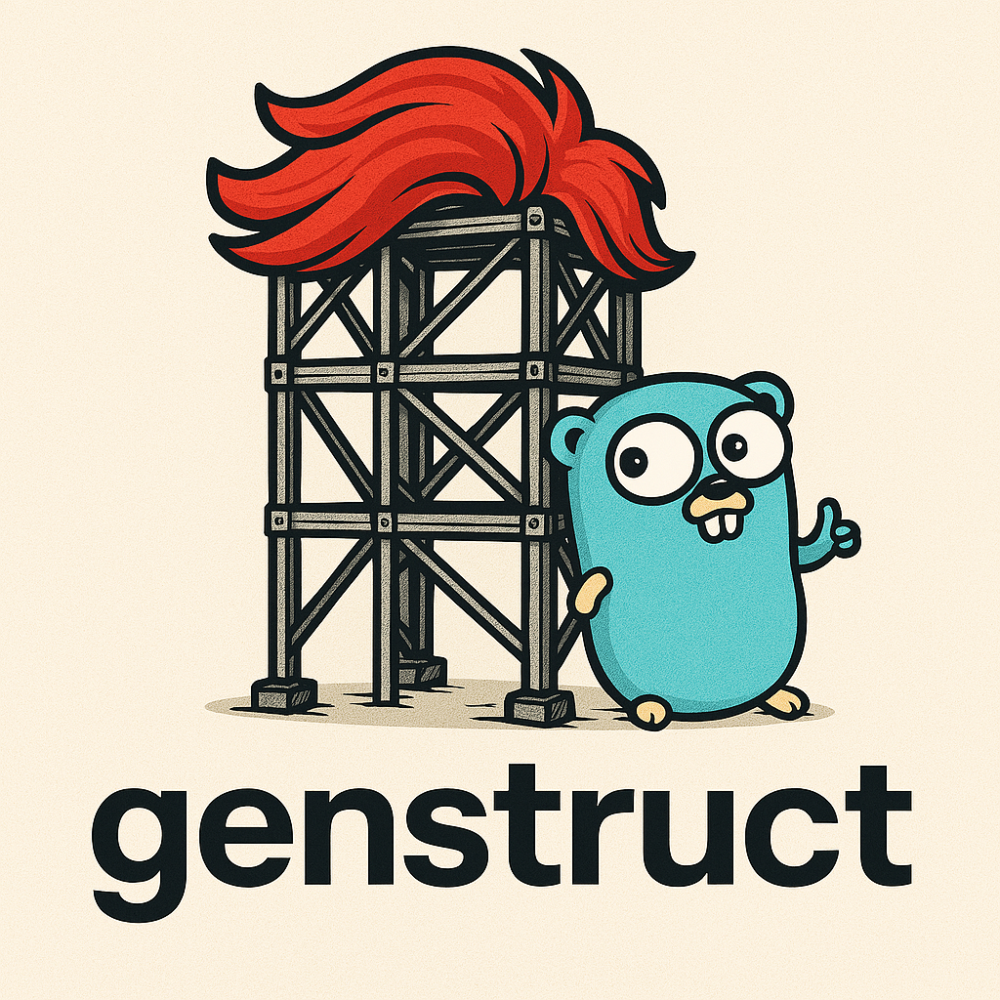

# genstruct



A Go library for generating statically defined Go structs with support for references between structures.

## Features

- Generate Go code for static structs and arrays
- Automatic creation of constants, variables, and slices
- Smart naming of variables based on identifier fields
- Reference embedding via struct tags to connect related structs
- Customizable code generation

## Installation

```bash
go get github.com/conneroisu/genstruct
```

## Basic Usage

```go
// Define your struct type
type Animal struct {
    ID     string
    Name   string
    Species string
    Diet   string
}

// Create a slice of structs
animals := []Animal{
    {ID: "lion-001", Name: "Leo", Species: "Lion", Diet: "Carnivore"},
    {ID: "tiger-001", Name: "Stripes", Species: "Tiger", Diet: "Carnivore"},
}

// Create a generator with functional options
generator := genstruct.NewGenerator(
    genstruct.WithPackageName("zoo"),       // Target package name
    genstruct.WithTypeName("Animal"),       // Struct type name
    genstruct.WithConstantIdent("Animal"),  // Prefix for constants
    genstruct.WithVarPrefix("Animal"),      // Prefix for variables
    genstruct.WithOutputFile("animals.go"), // Output file path
)

// Generate the code
err := generator.Generate(animals)
```

## Struct Reference Embedding

A powerful feature of genstruct is the ability to automatically populate fields in one struct by referencing values from another struct. References can be created using either direct struct references (`[]Tag`) or pointer-based struct references (`[]*Tag`). Pointer-based references are recommended as they are more memory efficient and allow for more flexible data structures.

### How it works

1. Define your structs with reference fields
2. Use the `structgen` tag to specify the source field
3. Pass all datasets to the `Generate` method

### Example

```go
// Define your tag struct
type Tag struct {
    ID   string
    Name string
    Slug string
}

// Define your post struct with references to tags
type Post struct {
    ID       string
    Title    string
    TagSlugs []string  // Contains tag slugs
    Tags     []*Tag    `structgen:"TagSlugs"` // Will be populated from TagSlugs with pointers to Tag objects
}

// Create your data
tags := []Tag{
    {ID: "tag-001", Name: "Go", Slug: "go"},
    {ID: "tag-002", Name: "Programming", Slug: "programming"},
}

posts := []Post{
    {
        ID: "post-001", 
        Title: "Introduction to Go",
        TagSlugs: []string{"go", "programming"},
    },
}

// Create a generator with functional options
generator := genstruct.NewGenerator(
    genstruct.WithPackageName("blog"),
    genstruct.WithOutputFile("blog_generated.go"),
)

// Generate code with both datasets
err := generator.Generate(posts, tags)
```

The generated code will include:
1. Constant definitions for all Post IDs
2. Variable definitions for each Post
3. A slice containing all Posts 
4. **Constant definitions for all Tag IDs**
5. **Variable definitions for each Tag**
6. **A slice containing all Tags**
7. **Cross-references between Posts and Tags** (the `Tags` field in each Post will contain pointers to the generated Tag variables)

All of this is generated in a single file, with a single generator call.

## Configuration Options

Configuration is done through functional options:

- `WithPackageName(name)`: Sets the package name for the generated file
- `WithTypeName(name)`: Sets the struct type name
- `WithConstantIdent(name)`: Sets the prefix for generated constants
- `WithVarPrefix(name)`: Sets the prefix for generated variables  
- `WithOutputFile(path)`: Sets the output file path
- `WithIdentifierFields(fields)`: Sets fields to use for naming (default: "ID", "Name", "Slug", "Title", "Key", "Code")
- `WithCustomVarNameFn(func)`: Sets a custom function to control variable naming
- `WithLogger(logger)`: Sets a custom slog.Logger instance

Many of these options are automatically inferred if not specified:
- TypeName: Inferred from the struct type in the data
- ConstantIdent: Defaults to TypeName if not specified
- VarPrefix: Defaults to TypeName if not specified
- OutputFile: Defaults to lowercase(typename_generated.go)
- IdentifierFields: Uses default fields if not specified
- Logger: Uses the default logger if not specified

Export mode (referencing types from other packages) is automatically determined based on the output file path. If the path contains directory separators, it will use qualified imports when referencing types from other packages.

## Dependencies

- [jennifer](https://github.com/dave/jennifer) for code generation


<!-- gomarkdoc:embed:start -->

<!-- Code generated by gomarkdoc. DO NOT EDIT -->

# genstruct

```go
import "github.com/conneroisu/genstruct"
```

Package genstruct provides an importable package for generating static golang struct arrays.

## Index

- [Constants](<#constants>)
- [func GetLogger\(\) \*slog.Logger](<#GetLogger>)
- [func InitLogger\(\) \*slog.Logger](<#InitLogger>)
- [func WithLevel\(level slog.Level\) \*slog.Logger](<#WithLevel>)
- [type Config](<#Config>)
- [type EmptyError](<#EmptyError>)
  - [func \(e EmptyError\) Error\(\) string](<#EmptyError.Error>)
- [type Generator](<#Generator>)
  - [func NewGenerator\(config Config, data any, refs ...any\) \(\*Generator, error\)](<#NewGenerator>)
  - [func \(g \*Generator\) Generate\(\) error](<#Generator.Generate>)
- [type InvalidTypeError](<#InvalidTypeError>)
  - [func \(e InvalidTypeError\) Error\(\) string](<#InvalidTypeError.Error>)
- [type NonSliceOrArrayError](<#NonSliceOrArrayError>)
  - [func \(e NonSliceOrArrayError\) Error\(\) string](<#NonSliceOrArrayError.Error>)


## Constants

<a name="LevelDebug"></a>Verbosity levels

```go
const (
    LevelDebug = "debug"
    LevelInfo  = "info"
    LevelWarn  = "warn"
    LevelError = "error"
)
```

<a name="GetLogger"></a>
## func [GetLogger](<https://github.com/conneroisu/genstruct/blob/main/logger.go#L87>)

```go
func GetLogger() *slog.Logger
```

GetLogger returns the default logger or initializes a new one if it doesn't exist

<a name="InitLogger"></a>
## func [InitLogger](<https://github.com/conneroisu/genstruct/blob/main/logger.go#L30>)

```go
func InitLogger() *slog.Logger
```

InitLogger initializes the logger with command line flags

<a name="WithLevel"></a>
## func [WithLevel](<https://github.com/conneroisu/genstruct/blob/main/logger.go#L95>)

```go
func WithLevel(level slog.Level) *slog.Logger
```

WithLevel returns a logger with the specified level

<a name="Config"></a>
## type [Config](<https://github.com/conneroisu/genstruct/blob/main/config.go#L12-L44>)

Config holds the configuration for code generation of static structs and arrays. Many fields are optional and will be automatically inferred if not specified.

```go
type Config struct {
    // PackageName defines the target package name
    // If not provided, defaults to "generated"
    PackageName string

    // TypeName is the name of the struct type to generate
    // If not provided, inferred from the struct type in the data
    TypeName string

    // ConstantIdent is the prefix for constants (e.g., "Post" for "PostMyPostID")
    // If not provided, defaults to the TypeName
    ConstantIdent string

    // VarPrefix is the prefix for variables (e.g., "Post" for "PostMyPost")
    // If not provided, defaults to the TypeName
    VarPrefix string

    // OutputFile is the output file name
    // If not provided, defaults to lowercase(typename_generated.go)
    OutputFile string

    // IdentifierFields are the fields to try using for naming, in priority order
    // If not provided, defaults to ["ID", "Name", "Slug", "Title", "Key", "Code"]
    IdentifierFields []string

    // CustomVarNameFn is a custom function to generate variable names (optional)
    // If provided, this takes precedence over IdentifierFields
    CustomVarNameFn func(structValue reflect.Value) string

    // Logger is the slog.Logger instance to use for logging
    // If not provided, defaults to a no-op logger
    Logger *slog.Logger
}
```

<a name="EmptyError"></a>
## type [EmptyError](<https://github.com/conneroisu/genstruct/blob/main/errors.go#L22>)

EmptyError is returned when the data given is empty.

```go
type EmptyError struct{}
```

<a name="EmptyError.Error"></a>
### func \(EmptyError\) [Error](<https://github.com/conneroisu/genstruct/blob/main/errors.go#L25>)

```go
func (e EmptyError) Error() string
```

Error returns the error message

<a name="Generator"></a>
## type [Generator](<https://github.com/conneroisu/genstruct/blob/main/generator.go#L16-L21>)

Generator is responsible for generating code for static struct arrays

```go
type Generator struct {
    Config Config
    Data   any            // The primary array of structs to generate code for
    Refs   map[string]any // Additional arrays that can be referenced
    File   *jen.File
}
```

<a name="NewGenerator"></a>
### func [NewGenerator](<https://github.com/conneroisu/genstruct/blob/main/generator.go#L62>)

```go
func NewGenerator(config Config, data any, refs ...any) (*Generator, error)
```

NewGenerator creates a new generator instance with support for struct references

Parameters:

- config: Configuration options for code generation
- data: The primary array of structs to generate code for
- refs: Optional additional arrays that can be referenced by the primary data

The refs parameters enable the use of struct tags with the \`structgen\` tag to reference data between structs. For example, a Post struct with a TagSlugs field can reference Tag structs using the tag \`structgen:"TagSlugs"\`.

When Generate\(\) is called, it will: 1. Generate constants, variables, and a slice for the primary data 2. Generate constants, variables, and a slice for each referenced data set 3. Create references between the primary data and the referenced data

Reference fields can be either direct structs or pointers to structs:

- \[\]Tag \`structgen:"TagSlugs"\` \- Direct struct references
- \[\]\*Tag \`structgen:"TagSlugs"\` \- Pointer\-based struct references \(recommended\)

Example usage:

```
generator, err := genstruct.NewGenerator(config, posts, tags)
if err != nil {
    // handle error
}
```

Many configuration options can be omitted and will be inferred automatically:

- TypeName: Inferred from the struct type in the data slice
- ConstantIdent: Defaults to TypeName if not specified
- VarPrefix: Defaults to TypeName if not specified
- OutputFile: Defaults to lowercase\(typename\_generated.go\) if not specified
- IdentifierFields: Has reasonable defaults if not specified

Returns an error if:

- The data is not a slice or array
- The data is empty \(no elements to analyze\)
- The data elements are not structs
- Required fields couldn't be inferred

<a name="Generator.Generate"></a>
### func \(\*Generator\) [Generate](<https://github.com/conneroisu/genstruct/blob/main/generator.go#L189>)

```go
func (g *Generator) Generate() error
```

Generate performs the code generation for both primary data and reference data

This method generates: 1. Constants for the primary data's IDs 2. Variables for each item in the primary data 3. A slice containing all primary data items 4. Constants for each reference data set's IDs 5. Variables for each item in each reference data set 6. A slice for each reference data set 7. Creates references between primary data and reference data as specified by structgen tags

All generated code is written to a single output file specified in the Config.

<a name="InvalidTypeError"></a>
## type [InvalidTypeError](<https://github.com/conneroisu/genstruct/blob/main/errors.go#L30-L32>)

InvalidTypeError is returned when the type of the data is not a struct.

```go
type InvalidTypeError struct {
    Kind reflect.Kind
}
```

<a name="InvalidTypeError.Error"></a>
### func \(InvalidTypeError\) [Error](<https://github.com/conneroisu/genstruct/blob/main/errors.go#L35>)

```go
func (e InvalidTypeError) Error() string
```

Error returns the error message

<a name="NonSliceOrArrayError"></a>
## type [NonSliceOrArrayError](<https://github.com/conneroisu/genstruct/blob/main/errors.go#L9-L11>)

NonSliceOrArrayError is returned when the data is not a slice or array.

```go
type NonSliceOrArrayError struct {
    Kind reflect.Kind
}
```

<a name="NonSliceOrArrayError.Error"></a>
### func \(NonSliceOrArrayError\) [Error](<https://github.com/conneroisu/genstruct/blob/main/errors.go#L14>)

```go
func (e NonSliceOrArrayError) Error() string
```

Error returns the error message

Generated by [gomarkdoc](<https://github.com/princjef/gomarkdoc>)


<!-- gomarkdoc:embed:end -->

